# `blue` Theme

This document shows the relationship of colors within the `blue` theme.

## base-green-100

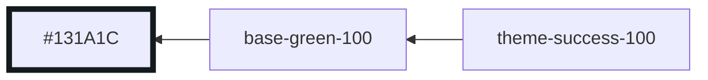

## base-green-200

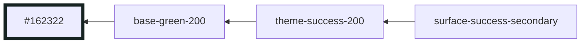

## base-green-300

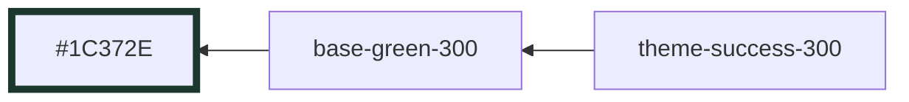

## base-green-400

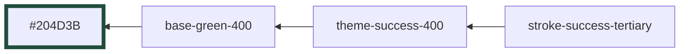

## base-green-500

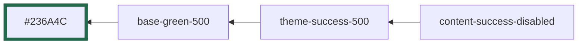

## base-green-600

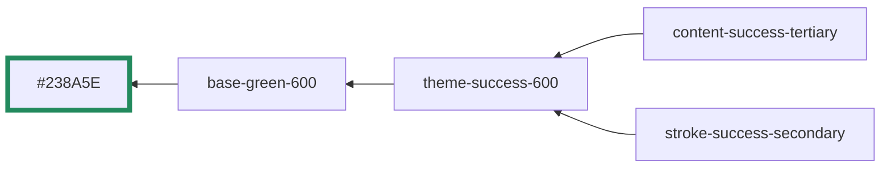

## base-green-700

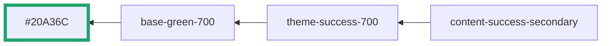

## base-green-800

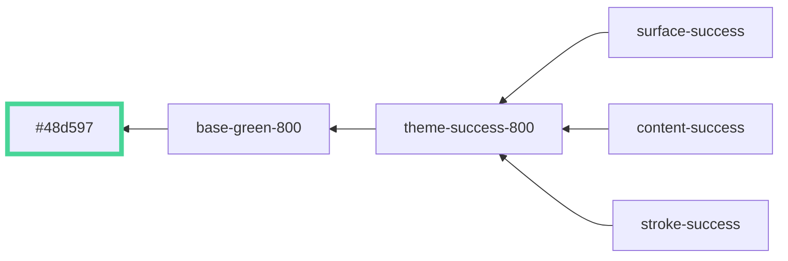

## base-yellow-100

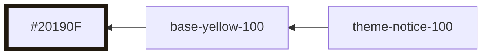

## base-yellow-200

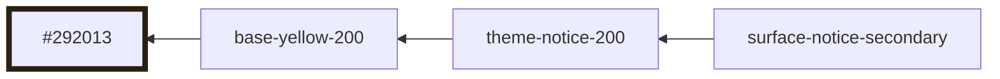

## base-yellow-300

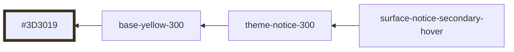

## base-yellow-400

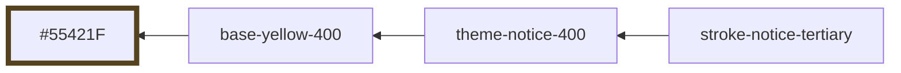

## base-yellow-500

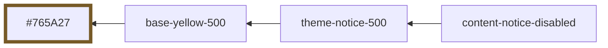

## base-yellow-600

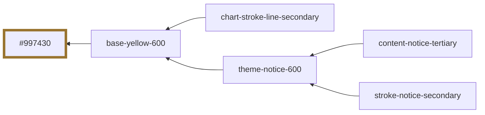

## base-yellow-700

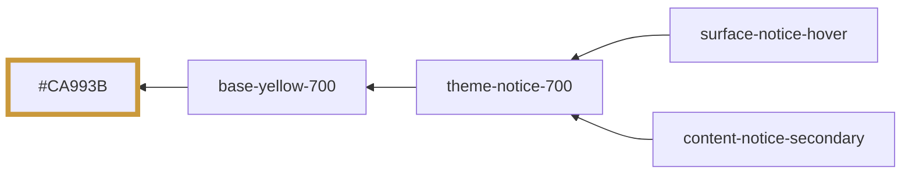

## base-yellow-800

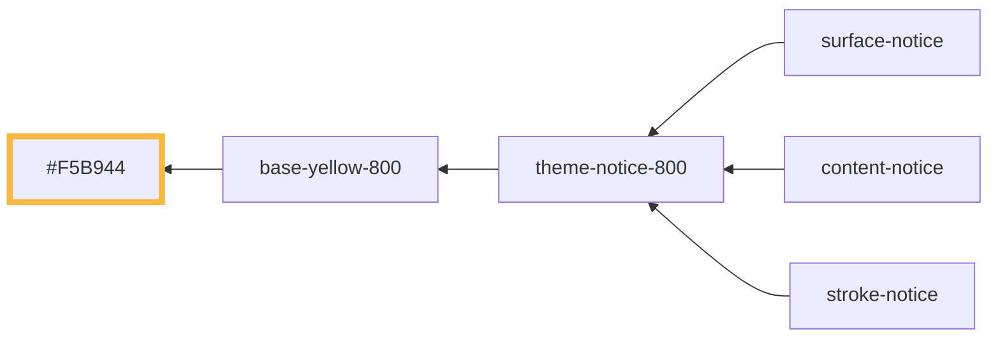

## base-red-100

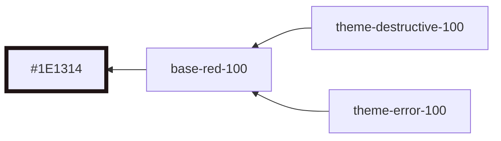

## base-red-200

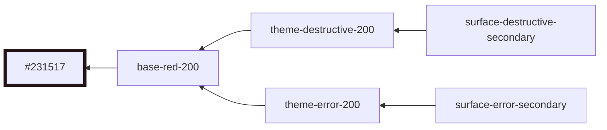

## base-red-300

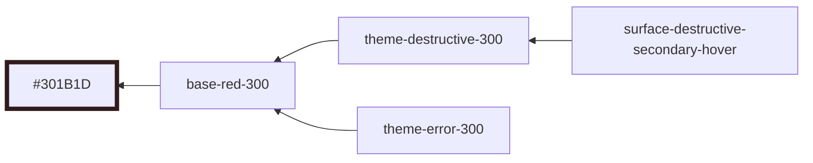

## base-red-400

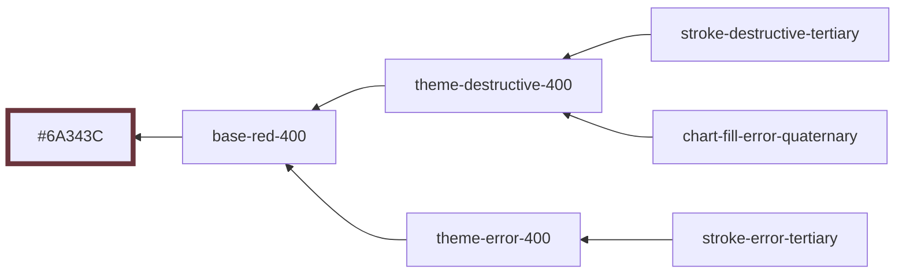

## base-red-500

```mermaid
graph RL
  base-red-500 --> #954553:::base-red-500
  content-destructive-disabled --> theme-destructive-500
  content-error-disabled --> theme-error-500
  chart-fill-error-tertiary --> theme-destructive-500
  theme-destructive-500 --> base-red-500
  theme-error-500 --> base-red-500

	classDef base-red-500 stroke-width:5,stroke:#954553
```

## base-red-600

```mermaid
graph RL
  base-red-600 --> #C3576A:::base-red-600
  content-destructive-tertiary --> theme-destructive-600
  content-error-tertiary --> theme-error-600
  stroke-destructive-secondary --> theme-destructive-600
  stroke-error-secondary --> theme-error-600
  chart-fill-error-secondary --> theme-destructive-600
  chart-stroke-line-tertiary --> base-red-600
  theme-destructive-600 --> base-red-600
  theme-error-600 --> base-red-600

	classDef base-red-600 stroke-width:5,stroke:#C3576A
```

## base-red-700

```mermaid
graph RL
  base-red-700 --> #DA6177:::base-red-700
  surface-destructive-hover --> theme-destructive-700
  content-destructive-secondary --> theme-destructive-700
  content-error-secondary --> theme-error-700
  chart-fill-error-primary --> theme-destructive-700
  theme-destructive-700 --> base-red-700
  theme-error-700 --> base-red-700

	classDef base-red-700 stroke-width:5,stroke:#DA6177
```

## base-red-800

```mermaid
graph RL
  base-red-800 --> #FB6E88:::base-red-800
  surface-destructive --> theme-destructive-800
  surface-error --> theme-error-800
  content-destructive --> theme-destructive-800
  content-error --> theme-error-800
  stroke-destructive --> theme-destructive-800
  stroke-error --> theme-error-800
  theme-destructive-800 --> base-red-800
  theme-error-800 --> base-red-800

	classDef base-red-800 stroke-width:5,stroke:#FB6E88
```

## base-purple-100

```mermaid
graph RL
  base-purple-100 --> #1E1822:::base-purple-100

	classDef base-purple-100 stroke-width:5,stroke:#1E1822
```

## base-purple-200

```mermaid
graph RL
  base-purple-200 --> #251F2B:::base-purple-200

	classDef base-purple-200 stroke-width:5,stroke:#251F2B
```

## base-purple-300

```mermaid
graph RL
  base-purple-300 --> #382D43:::base-purple-300

	classDef base-purple-300 stroke-width:5,stroke:#382D43
```

## base-purple-400

```mermaid
graph RL
  base-purple-400 --> #4D3E5E:::base-purple-400

	classDef base-purple-400 stroke-width:5,stroke:#4D3E5E
```

## base-purple-500

```mermaid
graph RL
  base-purple-500 --> #6C5584:::base-purple-500

	classDef base-purple-500 stroke-width:5,stroke:#6C5584
```

## base-purple-600

```mermaid
graph RL
  base-purple-600 --> #8B6DAC:::base-purple-600

	classDef base-purple-600 stroke-width:5,stroke:#8B6DAC
```

## base-purple-700

```mermaid
graph RL
  base-purple-700 --> #A380CB:::base-purple-700

	classDef base-purple-700 stroke-width:5,stroke:#A380CB
```

## base-purple-800

```mermaid
graph RL
  base-purple-800 --> #BE95EB:::base-purple-800

	classDef base-purple-800 stroke-width:5,stroke:#BE95EB
```

## base-blue-100

```mermaid
graph RL
  base-blue-100 --> #171821:::base-blue-100
  theme-accent-100 --> base-blue-100

	classDef base-blue-100 stroke-width:5,stroke:#171821
```

## base-blue-200

```mermaid
graph RL
  base-blue-200 --> #1E202D:::base-blue-200
  surface-accent-secondary --> theme-accent-200
  theme-accent-200 --> base-blue-200

	classDef base-blue-200 stroke-width:5,stroke:#1E202D
```

## base-blue-300

```mermaid
graph RL
  base-blue-300 --> #2D3048:::base-blue-300
  surface-accent-secondary-hover --> theme-accent-300
  theme-accent-300 --> base-blue-300

	classDef base-blue-300 stroke-width:5,stroke:#2D3048
```

## base-blue-400

```mermaid
graph RL
  base-blue-400 --> #3C4366:::base-blue-400
  stroke-accent-tertiary --> theme-accent-400
  chart-fill-item-quaternary --> theme-accent-400
  theme-accent-400 --> base-blue-400

	classDef base-blue-400 stroke-width:5,stroke:#3C4366
```

## base-blue-500

```mermaid
graph RL
  base-blue-500 --> #515B8F:::base-blue-500
  content-accent-disabled --> theme-accent-500
  chart-fill-item-tertiary --> theme-accent-500
  theme-accent-500 --> base-blue-500

	classDef base-blue-500 stroke-width:5,stroke:#515B8F
```

## base-blue-600

```mermaid
graph RL
  base-blue-600 --> #6776BB:::base-blue-600
  content-accent-tertiary --> theme-accent-600
  stroke-accent-secondary --> theme-accent-600
  chart-fill-item-secondary --> theme-accent-600
  chart-stroke-line-quaternary --> base-blue-600
  theme-accent-600 --> base-blue-600

	classDef base-blue-600 stroke-width:5,stroke:#6776BB
```

## base-blue-700

```mermaid
graph RL
  base-blue-700 --> #788ADD:::base-blue-700
  surface-accent-hover --> theme-accent-700
  content-accent-secondary --> theme-accent-700
  chart-fill-item-primary --> theme-accent-700
  chart-stroke-line --> theme-accent-700
  theme-accent-700 --> base-blue-700

	classDef base-blue-700 stroke-width:5,stroke:#788ADD
```

## base-blue-800

```mermaid
graph RL
  base-blue-800 --> #8BA1FF:::base-blue-800
  surface-accent --> theme-accent-800
  content-accent --> theme-accent-800
  stroke-accent --> theme-accent-800
  theme-accent-800 --> base-blue-800

	classDef base-blue-800 stroke-width:5,stroke:#8BA1FF
```

## base-neutral-0

```mermaid
graph RL
  base-neutral-0 --> #080F11:::base-neutral-0
  surface-default --> base-neutral-0
  content-inverse --> surface-default
  stroke-surface --> surface-default

	classDef base-neutral-0 stroke-width:5,stroke:#080F11
```

## base-neutral-50

```mermaid
graph RL
  base-neutral-50 --> #101618:::base-neutral-50
  surface-hover --> base-neutral-50
  surface-raise --> base-neutral-50
  content-inverse-raise --> surface-raise
  chart-fill-inactive --> base-neutral-50

	classDef base-neutral-50 stroke-width:5,stroke:#101618
```

## base-neutral-100

```mermaid
graph RL
  base-neutral-100 --> #141B1D:::base-neutral-100
  surface-raise-hover --> base-neutral-100
  surface-secondary --> base-neutral-100
  surface-disabled --> base-neutral-100
  content-inverse-secondary --> surface-secondary
  stroke-tertiary --> base-neutral-100

	classDef base-neutral-100 stroke-width:5,stroke:#141B1D
```

## base-neutral-200

```mermaid
graph RL
  base-neutral-200 --> #1C2225:::base-neutral-200
  surface-secondary-hover --> base-neutral-200
  surface-tertiary --> base-neutral-200
  stroke-secondary --> base-neutral-200
  chart-stroke-item-inactive --> base-neutral-200

	classDef base-neutral-200 stroke-width:5,stroke:#1C2225
```

## base-neutral-300

```mermaid
graph RL
  base-neutral-300 --> #2D3335:::base-neutral-300
  stroke-default --> base-neutral-300

	classDef base-neutral-300 stroke-width:5,stroke:#2D3335
```

## base-neutral-400

```mermaid
graph RL
  base-neutral-400 --> #404647:::base-neutral-400

	classDef base-neutral-400 stroke-width:5,stroke:#404647
```

## base-neutral-500

```mermaid
graph RL
  base-neutral-500 --> #5B5F61:::base-neutral-500
  content-quinary --> base-neutral-500
  content-disabled --> base-neutral-500
  stroke-raise --> base-neutral-500

	classDef base-neutral-500 stroke-width:5,stroke:#5B5F61
```

## base-neutral-600

```mermaid
graph RL
  base-neutral-600 --> #7e8385:::base-neutral-600
  content-quaternary --> base-neutral-600

	classDef base-neutral-600 stroke-width:5,stroke:#7e8385
```

## base-neutral-700

```mermaid
graph RL
  base-neutral-700 --> #A1A4A5:::base-neutral-700
  surface-inverse-tertiary --> content-tertiary
  content-tertiary --> base-neutral-700

	classDef base-neutral-700 stroke-width:5,stroke:#A1A4A5
```

## base-neutral-800

```mermaid
graph RL
  base-neutral-800 --> #B8BBBC:::base-neutral-800
  surface-inverse-secondary --> content-secondary
  content-secondary --> base-neutral-800

	classDef base-neutral-800 stroke-width:5,stroke:#B8BBBC
```

## base-neutral-900

```mermaid
graph RL
  base-neutral-900 --> #F6F6F7:::base-neutral-900
  surface-inverse --> content-default
  content-default --> base-neutral-900

	classDef base-neutral-900 stroke-width:5,stroke:#F6F6F7
```
